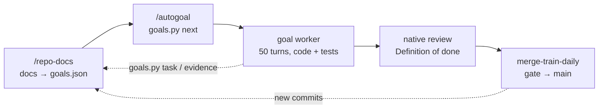

# hermes-shared-skills

[](https://github.com/TrebuchetDynamics/hermes-shared-skills/actions/workflows/test.yml)
[](LICENSE)

**Skills and slash commands that let a fleet of [Hermes Agent](https://github.com/NousResearch/hermes-agent)
profiles keep shipping on their own.** The fleet turns docs into goals and goals into tasks, works and
reviews the tasks, and lands the result on `main` every day. When it needs you, it asks and keeps going.

In Hermes every skill is a command (`/autogoal`; Telegram: `/repo_docs`). This repository holds only the
shared skills and the setup around them. Profiles, sessions and credentials stay on your machine.

- **Docs that drive the backlog.** `/repo-docs` keeps README, PRD, spec, test plan, runbook and changelog
  current, and turns every unmet goal into a task in `goals.json`.
- **Autonomous, bounded work.** `/autogoal` picks the next goal-linked task and hands it to a 50-turn
  goal worker. The picker itself never writes code.
- **Proof, not claims.** A goal counts as `met` only after an executed, passing check.
- **Main stays current.** A daily merge train gates the worktree's verified work and lands it, through
  a PR when the branch requires one.
- **Ask, don't block.** Questions go to you as a questionnaire, and reversible defaults apply meanwhile.

## How it works



1. **`repo-docs-on-change`** (cron, monitor-gated) builds or maintains the core docs and keeps
   `goals.json`: goals, status, evidence and tasks, ordered by product priority. It runs only when commits,
   finished cards, doc drift or ledger errors appear.
2. **`autogoal`** (cron) runs `goals.py next`, writes a contract from that task and dispatches it with
   `start_goal.py`. Its budget is about 30 tool calls per run.
3. **The worker** implements and tests the change, then records completion and evidence with `goals.py`.
   Handing the card to review is the goal's last step.
4. **`merge-train-daily`** (03:30, no model) gates the exact candidate tree in an isolated worktree and lands
   it on `main`. A failure that also happens on `main` doesn't block. New failing tests are held back as tasks.
5. **`fleet-governor`** (default profile) unsticks cards, routes idle profiles and reports open questions
   and merge-train results.

## Quick start

```bash
curl -fsSL https://hermes-agent.nousresearch.com/install.sh | bash        # Hermes itself, if missing
git clone https://github.com/TrebuchetDynamics/hermes-shared-skills ~/.hermes/shared-skills
~/.hermes/shared-skills/bootstrap.sh                                         # wire the default profile
~/.hermes/shared-skills/extras/install/new_profile.sh myproject ~/git/myproject --deliver telegram:<chat_id>
```

- **`bootstrap.sh`** wires the default profile:
  - adds this folder to `skills.external_dirs`;
  - installs the monitor, cleanup and merge-train wrappers;
  - pins the commands in the Telegram menu and adds the SOUL snippets;
  - turns off approval prompts and prunes unused skills;
  - installs the vendored skills;
  - schedules `merge-train-daily` and `scratch-cleanup-weekly`.

  Pass `--no-vendor` to skip the vendored skills.
- **`new_profile.sh`** creates or adopts a project profile:
  - sets its `terminal.cwd`;
  - wires it like the default profile, with the fleet skills disabled;
  - creates its `repo-docs-on-change` and `autogoal` cron jobs from `extras/cron/`.

  Add `--autogoal 15m` for busy profiles, or `--no-cron` to skip the jobs.
- **`install.sh --profiles a,b`** re-wires existing profiles and is idempotent. Options: `--disable-fleet`,
  `--telegram-menu`, `--soul`, `--allow-all`, `--prune`, `--dry-run`.
- **Updates:** `git -C ~/.hermes/shared-skills pull`. Every profile reads this folder live.

The paths assume the default location `~/.hermes/shared-skills`.
Use `hermes skills tap add TrebuchetDynamics/hermes-shared-skills` to install individual skills
through the Hermes hub instead.

## Commands

### Fleet workflow

| Command | What it does |
|---|---|
| `/autogoal` | Picks the next goal-linked task (`goals.py next`) and hands it to a native 50-turn goal worker. The picker never implements. |
| `/repo-docs` | Builds or maintains the core docs, keeps `goals.json`, and turns every unmet goal into a task. |
| `/git-commit-push` | Ships local changes safely in shared worktrees: stage → gate → push, then verify the remote. |
| `/git-pull-merge` | Brings remote or branch changes in safely: fetch, check overlap with others' dirty work, fast-forward or merge (never rebase or force), resolve conflicts, re-gate. |
| `/lgtm` | Resolves a short approval against the latest checkpoint without widening scope. |
| `/grill-me` | Stress-tests a plan. It is also the questionnaire format agents use whenever they need the user. |
| `/hard-blockers` | Keeps `BLOCKERS.md` as the owner's open-questions ledger; defaults apply and work continues. |
| `/fleet-governor`, `/fleet-blockers`, `/fleet-status` | Default-profile coordination, including the daily [merge train](fleet-governor/references/merge-train.md). Disabled in project profiles. |

<details>
<summary><b>Engineering practice</b>: skills the fleet's agents wrote from real incidents</summary>

| Command | Use when |
|---|---|
| `/shared-worktree-commit-safety` | committing a dirty tree other agents may be writing |
| `/codebase-audit-verification` | auditing a repo before reporting issues (read-only) |
| `/docker-build-context-verification` | changing Docker build contexts or `.dockerignore` |
| `/parallel-mechanical-edits`, `/consolidating-shared-constants` | fanning a mechanical change out; deduplicating repeated literals |
| `/local-visual-verification`, `/operator-console-design` | verifying a UI change before claiming done; operator console UIs |
| `/reference-product-port`, `/upstream-reference-verification` | porting a reference product; checking upstream clones and freshness |
| `/repository-knowledge-engineering`, `/repository-maintenance` | building durable repo expertise; syncing repos and submodules |
| `/mobile-release` | releasing mobile apps (version and gate checks) |
| `/recurring-job-management` | tuning a Hermes cron job's schedule or cadence |
| `/understand-anything-hermes` | installing and running Understand-Anything in a profile |
| `/audio-generation` | creating spoken audio |

Project-specific skills, such as codebase maps or domain triage, stay in their own profiles.

</details>

<details>
<summary><b>Vendored third-party skills</b>: 16 curated commands, pinned upstream</summary>

`extras/vendor/manifest.json` pins curated skills from other repositories. `extras/vendor/sync_vendor.py`
installs them into `vendor/<source>/<skill>/`. That folder is gitignored, so each license stays with its source.
Each skill gets a short Hermes note that maps other harnesses' tool names to Hermes tools and says that
fleet rules win. `bootstrap.sh` runs the sync. Re-run it any time, or with `--pin` to move to upstream HEAD.
It refuses names that collide with first-party or Hermes-bundled skills.

| Source (license) | Commands |
|---|---|
| pbakaus/impeccable (Apache-2.0) | `/impeccable` (+ fleet overlay) |
| DietrichGebert/ponytail (MIT) | `/ponytail`, `/ponytail-review` |
| mattpocock/skills (MIT) | `/grill-with-docs`, `/prototype`, `/improve-codebase-architecture`, `/domain-modeling`, `/writing-for-agents` |
| ayghri/i-have-adhd (MIT) | `/i-have-adhd` |
| cloudflare/security-audit-skill (MIT) | `/security-audit` |
| obra/superpowers (MIT) | `/receiving-code-review` |
| cathrynlavery/diagram-design (MIT) | `/diagram-design` |
| addyosmani/agent-skills (MIT) | `/api-and-interface-design`, `/observability-and-instrumentation`, `/performance-optimization`, `/deprecation-and-migration` |

**Deliberately not vendored (2026-10-06 audit):**
- **Overlaps with skills the fleet already uses:**
  - code-simplification, ponytail-audit and ponytail-debt (ponytail, omh-tech-debt-audit);
  - security-and-hardening (security-audit);
  - verification-before-completion (omh-verification-gate and the met rule);
  - ci-cd (omh-automation-blueprint);
  - browser-testing (local-visual-verification, omh-visual-qa);
  - context-engineering (writing-for-agents);
  - writing-skills (hermes-agent-skill-authoring);
  - session-handoff (the core `/handoff` command).
- **Duplicates of bundled or first-party skills:** humanizer, TDD, systematic debugging, code review, grill-me.
- **Overlaps with autogoal, repo-docs or git-commit-push.**
- **Skills that force approval gates:** superpowers' using-superpowers and brainstorming.
- **graphify:** a CLI rather than a skill; understand-anything-hermes covers it.

</details>

## Design rules

These rules are shared by the skills above and carried into every profile through `extras/soul/`.

- **Ask, don't block.** Needing the user means a questionnaire and a reversible default, never a paused goal
  ([`ask-dont-block.md`](extras/soul/ask-dont-block.md)).
- **The met rule.** A goal is `met` only with an executed, passing check recorded through `goals.py`
  ([`goal-ledger.md`](extras/soul/goal-ledger.md)).
- **The review handoff is a goal's last step.** Approval comes afterwards, which avoids a circular review gate
  ([`review-handoff.md`](extras/soul/review-handoff.md)).
- **Scratch hygiene.** Workers keep scratch out of `~/.cache` and clean up build output. A weekly job removes
  leftovers ([`scratch-hygiene.md`](extras/soul/scratch-hygiene.md)).

## Operating the fleet

| Cron job | Profile | Schedule | What it does |
|---|---|---|---|
| `repo-docs-on-change` | each project | every 10 min, model only on real change | docs, `goals.json`, drift fixes |
| `autogoal` | each project | hourly (or 15 min) | pick and dispatch one goal-linked task |
| `merge-train-daily` | default | 03:30, no model | gate and land verified worktree work on `main` |
| `scratch-cleanup-weekly` | default | Sun 04:17, no model | delete worker scratch older than 7 days |

Prompt templates and placeholders: [`extras/cron/`](extras/cron/README.md).
Merge-train details and opt-out: [`fleet-governor/references/merge-train.md`](fleet-governor/references/merge-train.md).

**Pruning.** `install.sh --prune` adds every name in `extras/install/disabled-skills.txt` to the profile's
`skills.disabled`. Those are Hermes-bundled and omh skills that nobody used or viewed in about 500 sessions
across 8 profiles (2026-10-06 audit). Each enabled skill costs a line in every prompt. To re-enable one,
delete its line and remove it from the profile's `skills.disabled`.

## Layout

```
<skill>/SKILL.md (+ references/, scripts/)   one folder per skill = one command
shared/COMMON-CONTRACT.md                     contract several skills follow
extras/monitors/      cron monitor scripts (skip the model when nothing changed)
extras/cron/          cron prompt templates
extras/soul/          SOUL.md snippets every worker must see
extras/vendor/        pinned third-party skill manifest + sync
extras/impeccable/    Hermes overlay for impeccable
extras/maintenance/   scratch cleanup and merge-train cron entry points
extras/install/       install helper, new_profile.sh, disabled-skills.txt
bootstrap.sh          one-shot setup for a new machine
install.sh            per-profile wiring
scripts/check.py      offline test and lint runner (CI)
```

## Tests

```bash
python3 -m pip install 'ruamel.yaml>=0.18,<0.19'   # already included in Hermes' runtime
python3 scripts/check.py                        # or: make test
```

The same command runs in CI: it validates all first-party skill frontmatter with a real YAML
parser (including the 60-character description budget), checks Python and shell syntax, and
runs each offline `test_*.py` suite in an isolated process with a timeout. It includes fleet-status
and helper-script tests. Vendored upstream content and hidden directories are excluded;
`extras/vendor/` is first-party sync tooling and is included.

`repo-docs/scripts/test_goal_gap_regression.py` and `hard-blockers/scripts/test_repo_docs.py` are
behavioral regressions that call a real model through `hermes chat`. They are explicitly excluded
from the offline runner. Run them manually after policy changes. New model-backed tests must
also be added to `MODEL_TESTS` in `scripts/check.py` before using the offline runner.

## Credits and license

MIT, Copyright (c) 2026 Trebuchet Dynamics (see [LICENSE](LICENSE)). `grill-me`, `lgtm`, `repo-docs`,
`git-commit-push` and `shared/COMMON-CONTRACT.md` are adapted from
[TrebuchetDynamics/pi-toolset](https://github.com/TrebuchetDynamics/pi-toolset). Vendored skills keep their
own licenses; see [NOTICE.md](NOTICE.md).
